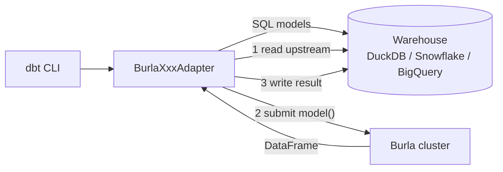

---
hide:
  - navigation
  - toc
---

<div class="hero" markdown>

# Run dbt Python models on 1,000 CPUs in 1 second.

<p class="hero-sub" markdown>
  **dbt-burla** is a dbt adapter that runs Python models on a [Burla](https://burla.dev) cluster instead of Snowpark, Dataproc, or Databricks - while your SQL keeps running in DuckDB, Snowflake, or BigQuery.
</p>

<div class="hero-buttons" markdown>
[Get started :material-rocket-launch:](quickstart.md){ .md-button .md-button--primary }
[View on GitHub :fontawesome-brands-github:](https://github.com/Burla-Cloud/dbt-burla){ .md-button }
[Install from PyPI :fontawesome-brands-python:](https://pypi.org/project/dbt-burla/){ .md-button }
</div>

</div>

## The problem

dbt's Python model support is **gated behind Spark**.

If you want to run Python in a dbt DAG today, you pick one of three:

1. **Snowpark** - Python runs as a Snowflake stored procedure. Expensive compute. No custom images. No GPUs.
2. **Dataproc** - Python runs on managed Google Cloud Spark. Minutes of startup per model.
3. **Databricks** - Python runs on a Databricks cluster you maintain. Separate bill, separate platform.

All three assume **distributed Spark DataFrames**.

But most Python work in a dbt DAG *isn't* that. It's embarrassingly-parallel per-row work:

- ML scoring: `model.predict(row)` on every row
- LLM enrichment: API call per row
- Feature engineering: 20 new columns per row
- Per-row simulation, classification, embedding, OCR, geocoding

**This doesn't need a JVM Spark cluster.** It needs a lot of Python processes running at the same time.

## The solution

`dbt-burla` is a dbt adapter that runs Python models on a [Burla](https://burla.dev) cluster. Burla is a Python-first compute platform: one function call gives you up to 10,000 parallel VMs in about a second. Any Docker image. Any CPU/RAM shape. Any GPU.

```python title="models/scored_customers.py"
import pandas as pd
from burla import remote_parallel_map


def score(row: dict) -> dict:
    row["churn_score"] = my_model.predict(row)
    return row


def model(dbt, session):
    dbt.config(
        materialized="table",
        burla_workers=500,           # 500 VMs, each runs score() on a batch
        burla_cpus_per_worker=4,
    )
    customers = dbt.ref("stg_customers").to_dict("records")
    scored = list(remote_parallel_map(score, customers))
    return pd.DataFrame(scored)
```

SQL keeps running in your warehouse, unchanged. Python runs on Burla. Lineage, `ref()`, tests, docs, incremental models - everything dbt-core gives you - all still work.

## Why you'd actually use this

<div class="grid cards" markdown>

-   :material-lightning-bolt:{ .lg .middle } **No cluster to manage**

    ---

    No Snowpark session. No Databricks cluster. No Dataproc template. Burla gives you elastic compute as a function call: `remote_parallel_map(fn, inputs)`. Workers start in <1s.

-   :material-check-all:{ .lg .middle } **Every dbt feature still works**

    ---

    `dbt-burla` is a **subclass** of your warehouse adapter. SQL models run unchanged. Lineage, `ref()`, `source()`, tests, docs, incremental models, `is_incremental`, snapshots - all inherited from dbt-core.

-   :material-docker:{ .lg .middle } **Any Docker image, any hardware**

    ---

    `burla_cpus_per_worker=64` for heavy compute. `burla_image="..."` for your own dependencies baked in. `burla_ram_per_worker=128` for in-memory work. Every Python model has its own shape.

-   :material-flash:{ .lg .middle } **Zero-setup local dev**

    ---

    `burla_fake: true` runs Python models in-process with no cluster, no cloud, no credentials. Perfect for local dev, tests, and CI. Your whole dbt project runs on your laptop.

-   :material-database:{ .lg .middle } **Bring your warehouse**

    ---

    First-class support for **DuckDB**, **Snowflake**, and **BigQuery**. Write Python the same way; dbt-burla handles the pandas ⇄ warehouse transfer for you.

-   :material-shield-check:{ .lg .middle } **Production ready**

    ---

    `mypy --strict`, 97% test coverage, CI on Python 3.11 / 3.12 / 3.13, dbt-core 1.8 and 1.9, real integration tests against every warehouse.

</div>

## When `dbt-burla` is NOT the right pick

- **All SQL, no Python.** You don't need this. Stick with `dbt-duckdb` / `dbt-snowflake` / `dbt-bigquery`.
- **Terabyte-scale distributed joins.** That's Spark's job. Use Snowpark or Databricks for those shuffles.
- **Unsupported warehouse.** Postgres, Redshift, Fabric, etc. aren't supported yet. [File an issue](https://github.com/Burla-Cloud/dbt-burla/issues).
- **Very large upstream inputs.** The Python model pulls the upstream table through pandas on your dbt runner. For 100M+ row inputs, aggregate in SQL first.

## `dbt-burla` vs the alternatives

<div class="compat-table" markdown>

|                                              | `dbt-burla` | Snowpark | Dataproc | Databricks |
| :------------------------------------------- | :---------: | :------: | :------: | :--------: |
| No Spark / JVM cluster to manage             |      ✓      |    ✓     |          |            |
| Sub-second worker startup                    |      ✓      |          |          |            |
| Scales to 1,000+ VMs in one call             |      ✓      |          |          |            |
| Per-model CPU / RAM / GPU shape              |      ✓      |          |    ✓     |     ✓      |
| Any Docker image                             |      ✓      |          |    ✓     |     ✓      |
| Runs locally with no cloud                   |      ✓      |          |          |            |
| Works with DuckDB                            |      ✓      |          |          |            |
| Works with Snowflake                         |      ✓      |    ✓     |          |            |
| Works with BigQuery                          |      ✓      |          |    ✓     |            |
| Distributed joins / shuffles                 |             |    ✓     |    ✓     |     ✓      |
| Snowflake-native Python UDFs                 |             |    ✓     |          |            |

</div>

## Install

<div class="grid" markdown>

```bash title="DuckDB - zero setup"
pip install "dbt-burla[duckdb]"
```

```bash title="Snowflake"
pip install "dbt-burla[snowflake]"
```

```bash title="BigQuery"
pip install "dbt-burla[bigquery]"
```

</div>

## 60-second quickstart

```bash
git clone https://github.com/Burla-Cloud/dbt-burla.git
cd dbt-burla/examples/01-quickstart-duckdb
pip install "dbt-burla[duckdb]"
dbt run --profiles-dir .
```

Three models run end-to-end: a SQL view, a Python `table` model, and a downstream SQL aggregate. No cloud, no cluster, no credentials. Flip `burla_fake: false` and your Python models run on a real Burla cluster.

[Full quickstart :material-arrow-right:](quickstart.md){ .md-button }

## How it works



[Deep dive :material-arrow-right:](how-it-works.md){ .md-button }

## Compatibility

<div class="compat-table" markdown>

| dbt-core | Python              | DuckDB | Snowflake | BigQuery |
| -------- | ------------------- | :----: | :-------: | :------: |
| 1.8.x    | 3.11 / 3.12 / 3.13  | ✓      | ✓         | ✓        |
| 1.9.x    | 3.11 / 3.12 / 3.13  | ✓      | ✓         | ✓        |

</div>

dbt Fusion (Rust) is planned but not yet supported.

## Examples

<div class="grid cards" markdown>

- [:material-rocket-launch-outline: **Quickstart (DuckDB)**](https://github.com/Burla-Cloud/dbt-burla/tree/main/examples/01-quickstart-duckdb)

    Zero-setup, self-contained, runs in seconds.

- [:material-brain: **Snowflake ML scoring**](https://github.com/Burla-Cloud/dbt-burla/tree/main/examples/02-snowflake-ml-scoring)

    Fan out ML inference to 500 workers over a Snowflake table.

- [:material-chat-processing: **BigQuery LLM enrichment**](https://github.com/Burla-Cloud/dbt-burla/tree/main/examples/03-bigquery-llm-enrichment)

    Per-row LLM API calls across a BigQuery dataset.

- [:material-arrow-expand: **Heavy compute fan-out**](https://github.com/Burla-Cloud/dbt-burla/tree/main/examples/04-fan-out-heavy-compute)

    `remote_parallel_map` inside a model for massive parallelism.

</div>

## Status

`v0.x` - API may change before `v1.0`. Follow the [CHANGELOG](https://github.com/Burla-Cloud/dbt-burla/blob/main/CHANGELOG.md) for breaking changes.

Questions? [Open an issue](https://github.com/Burla-Cloud/dbt-burla/issues) or [schedule a call](https://cal.com/jakez/burla).
